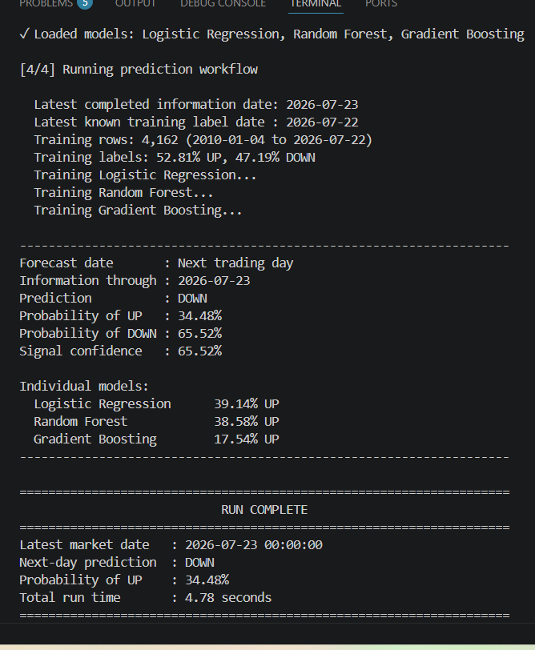

<p align="center">
  
</p>

# Quant Machine 📈

# Quant Machine 📈

A Python-based quantitative trading system that predicts next-day stock movement using an ensemble of machine learning models and evaluates performance through realistic walk-forward backtesting.

## Features

- Ensemble machine learning (Logistic Regression, Random Forest, Gradient Boosting)
- Walk-forward validation (no look-ahead bias)
- Automatic market data collection with Yahoo Finance
- 94 engineered technical and market features
- BUY / SELL / HOLD predictions with confidence scores
- Backtesting with transaction costs and portfolio tracking
- Performance metrics including Sharpe ratio, drawdown, accuracy, and Brier score

## Tech Stack

- Python
- Pandas
- NumPy
- Scikit-learn
- yfinance

## Example Output

```
Directional Accuracy : 49.06%
Trades Taken         : 15
Strategy Return      : +33.91%
Buy-and-Hold Return  : +59.92%
Sharpe Ratio         : 2.64
```

## Why I Built It

I wanted to learn how quantitative trading systems are built while improving my skills in machine learning, software engineering, and financial data analysis. Rather than using a simple train/test split, this project performs walk-forward retraining to better simulate how a model would operate in a real trading environment.

## Future Improvements

- Rolling training windows
- XGBoost and LightGBM models
- Portfolio optimization
- Multi-stock support
- Interactive dashboard
